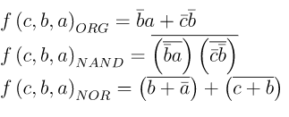
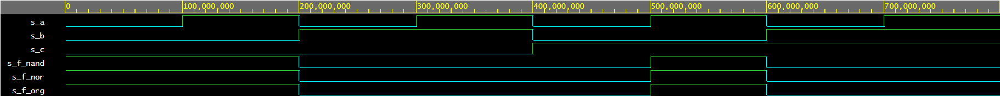
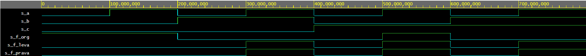

# Lab 1: Monika Vlkova

### De Morgan's laws

1. Equations of all three versions of logic function f(c,b,a):




2. Listing of VHDL architecture from design file (`design.vhd`) for all three functions. Always use syntax highlighting, meaningful comments, and follow VHDL guidelines:

```vhdl
architecture dataflow of demorgan is
begin
    f_org_o  <= (not(b_i) and a_i) or (not(c_i) and not(b_i));
    f_nand_o <= (not(b_i) nand a_i) nand (not(c_i) nand not(b_i));
    f_nor_o  <= (b_i nor not(a_i)) or (c_i nor b_i)
end architecture dataflow;
```

3. Complete table with logic functions' values:

| **c** | **b** |**a** | **f(c,b,a)_ORG** | **f(c,b,a)_NAND** | **f(c,b,a)_NOR** |
| :-: | :-: | :-: | :-: | :-: | :-: |
| 0 | 0 | 0 | 1 | 1 | 1 |
| 0 | 0 | 1 | 1 | 1 | 1 |
| 0 | 1 | 0 | 0 | 0 | 0 |
| 0 | 1 | 1 | 0 | 0 | 0 |
| 1 | 0 | 0 | 0 | 0 | 0 |
| 1 | 0 | 1 | 1 | 1 | 1 |
| 1 | 1 | 0 | 0 | 0 | 0 |
| 1 | 1 | 1 | 0 | 0 | 0 |

### Distributive laws

1. Screenshot with simulated time waveforms. Always display all inputs and outputs (display the inputs at the top of the image, the outputs below them) at the appropriate time scale!

	De Morgan's laws:


	Distributive Laws: 


2. Link to your public EDA Playground example:

De Morgan's laws:
	https://www.edaplayground.com/x/D4kd

Distributive Laws:
	https://www.edaplayground.com/x/KemU
   